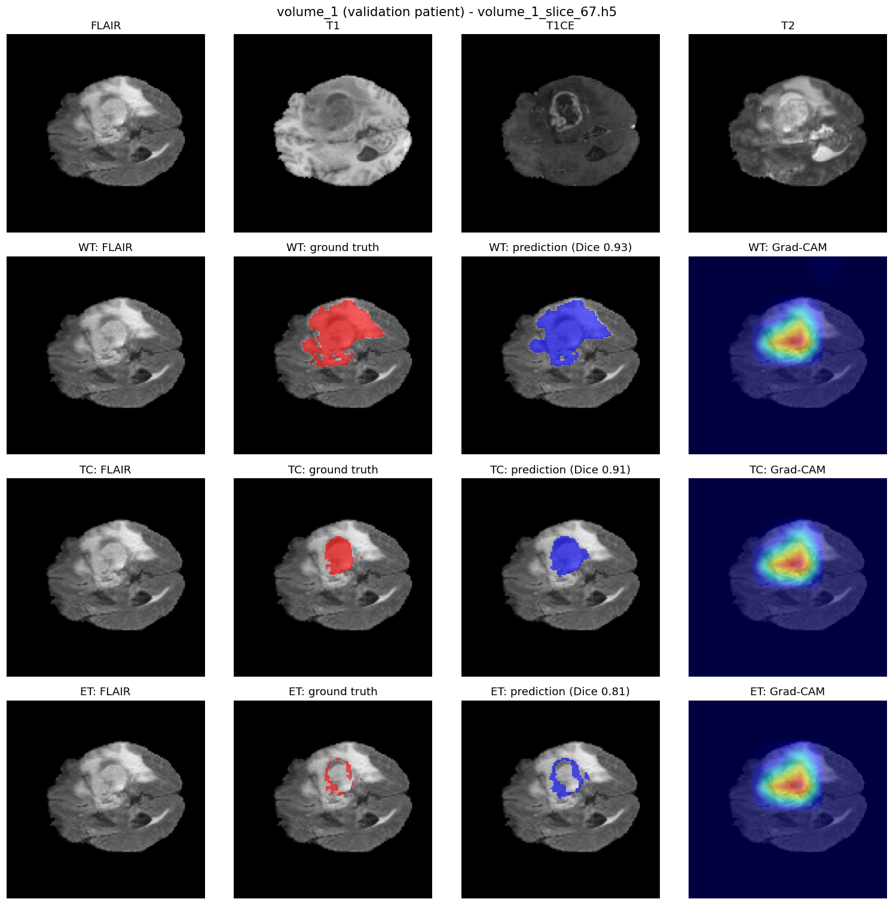
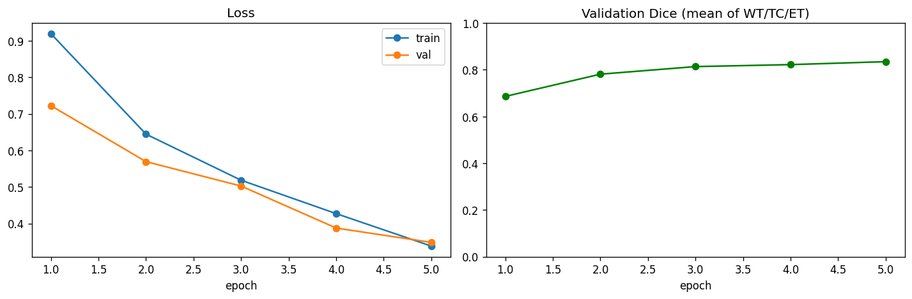

# Brain Tumor Segmentation with Explainable AI (XAI)

Segmentation of brain tumor sub-regions in multi-modal MRI (BraTS 2020) with a from-scratch 2D U-Net in PyTorch, plus Grad-CAM heatmaps that show where the model looks when it predicts each region.


## Overview

Each patient has four MRI modalities (FLAIR, T1, T1ce, T2). The model predicts three **nested** tumor regions:

| Region | Contains | Raw labels |
|---|---|---|
| **WT** – Whole Tumor | everything abnormal | 1, 2, 4 |
| **TC** – Tumor Core | tumor without the edema | 1, 4 |
| **ET** – Enhancing Tumor | actively enhancing part | 4 |

Because the regions overlap, the output is **multi-label** (one sigmoid per region), not a softmax.

## Results

2D U-Net (7.76M parameters), `DiceFocalLoss`, Adam + cosine LR, **5 epochs** on an Apple M-series GPU (MPS, ~15 min).
Validation set: **74 patients never seen in training** (patient-level split, 295 / 74).

| Region | Dice | IoU |
|---|---|---|
| WT | **0.891** | 0.803 |
| TC | **0.839** | 0.723 |
| ET | **0.775** | 0.632 |
| **Mean** | **0.835** | 0.719 |

> Metrics are computed on 2D slices that contain tumor (4,902 validation slices), accumulated over the whole validation set. This is not the official BraTS 3D volume-level evaluation.

**Prediction + Grad-CAM** on a validation patient (the slice with the most tumor pixels):



**Training curves:** validation Dice was still rising at epoch 5, so longer training should help.



## Method

- **Data:** pre-sliced HDF5 version of BraTS 2020 (369 patients, 57,195 slices of 240×240×4, already z-normalized). Only the 24,422 slices that contain tumor are used. Slices are resized to 128×128, and training slices are randomly flipped horizontally.
- **Model:** classic U-Net encoder–decoder with skip connections (`src/models.py`). MONAI's residual U-Net and Attention U-Net are available through the same `get_model()` factory.
- **Loss:** Dice loss (optimizes overlap, robust to the small tumor area) + Focal loss (down-weights easy background pixels).
- **Explainability:** Grad-CAM on the last feature-rich conv layer, targeting the predicted pixels of the chosen region (`src/explainability.py`).

## Project Structure

```
├── src/
│   ├── config.py           # paths, labels, hyperparameters, device selection
│   ├── dataset.py          # h5 loader, raw labels -> WT/TC/ET, patient-level split
│   ├── models.py           # 2D U-Net from scratch + model factory
│   ├── losses.py           # Dice / Focal / DiceFocal
│   ├── train.py            # training loop, per-region Dice/IoU, best checkpoint
│   ├── explainability.py   # Grad-CAM
│   └── predict.py          # GT vs prediction vs Grad-CAM figure
├── app/
│   └── app.py              # Streamlit demo
├── figures/                # images used in this README
└── requirements.txt
```

## Getting Started

```bash
pip install -r requirements.txt

# Data: download the HDF5 version from Kaggle (awsaf49/brats2020-training-data),
# then link the folder with the .h5 files into the project:
ln -sfn /path/to/BraTS2020_training_data/content/data data/brats_h5

python src/config.py                 # check paths + device
python src/dataset.py                # sample figure -> figures/dataset_sample.png
python src/train.py --epochs 5       # train (on Mac: PYTORCH_ENABLE_MPS_FALLBACK=1)
python src/predict.py                # demo figure -> figures/demo_prediction.png
streamlit run app/app.py             # interactive demo
```

The data (~15 GB) and model weights are not included in the repository.

## Dataset

This project uses the **pre-sliced HDF5 version** of the BraTS 2020 training data from Kaggle:
[Brain Tumor Segmentation (BraTS2020)](https://www.kaggle.com/datasets/awsaf49/brats2020-training-data) by Awsaf ([awsaf49](https://www.kaggle.com/awsaf49)), released under **CC0: Public Domain**.
Only 2D slices derived from this de-identified (skull-stripped, co-registered) data are shown in the figures; the data itself is not redistributed in this repository.

## References

### Dataset (as required by the BraTS data usage agreement)

1. B. H. Menze, A. Jakab, S. Bauer, J. Kalpathy-Cramer, K. Farahani, J. Kirby, et al., "The Multimodal Brain Tumor Image Segmentation Benchmark (BRATS)", *IEEE Transactions on Medical Imaging*, 34(10), 1993–2024, 2015. DOI: [10.1109/TMI.2014.2377694](https://doi.org/10.1109/TMI.2014.2377694)
2. S. Bakas, H. Akbari, A. Sotiras, M. Bilello, M. Rozycki, J. S. Kirby, et al., "Advancing The Cancer Genome Atlas glioma MRI collections with expert segmentation labels and radiomic features", *Scientific Data*, 4:170117, 2017. DOI: [10.1038/sdata.2017.117](https://doi.org/10.1038/sdata.2017.117)
3. S. Bakas, M. Reyes, A. Jakab, S. Bauer, M. Rempfler, A. Crimi, et al., "Identifying the Best Machine Learning Algorithms for Brain Tumor Segmentation, Progression Assessment, and Overall Survival Prediction in the BRATS Challenge", arXiv:[1811.02629](https://arxiv.org/abs/1811.02629), 2018.
4. S. Bakas, H. Akbari, A. Sotiras, M. Bilello, M. Rozycki, J. Kirby, et al., "Segmentation Labels for the Pre-operative Scans of the TCGA-GBM collection", *The Cancer Imaging Archive*, 2017. DOI: [10.7937/K9/TCIA.2017.KLXWJJ1Q](https://doi.org/10.7937/K9/TCIA.2017.KLXWJJ1Q)
5. S. Bakas, H. Akbari, A. Sotiras, M. Bilello, M. Rozycki, J. Kirby, et al., "Segmentation Labels for the Pre-operative Scans of the TCGA-LGG collection", *The Cancer Imaging Archive*, 2017. DOI: [10.7937/K9/TCIA.2017.GJQ7R0EF](https://doi.org/10.7937/K9/TCIA.2017.GJQ7R0EF)

### Methods

6. O. Ronneberger, P. Fischer, T. Brox, "U-Net: Convolutional Networks for Biomedical Image Segmentation", *MICCAI*, 2015. arXiv:[1505.04597](https://arxiv.org/abs/1505.04597)
7. F. Milletari, N. Navab, S.-A. Ahmadi, "V-Net: Fully Convolutional Neural Networks for Volumetric Medical Image Segmentation" (Dice loss), *3DV*, 2016. arXiv:[1606.04797](https://arxiv.org/abs/1606.04797)
8. T.-Y. Lin, P. Goyal, R. Girshick, K. He, P. Dollár, "Focal Loss for Dense Object Detection", *ICCV*, 2017. arXiv:[1708.02002](https://arxiv.org/abs/1708.02002)
9. R. R. Selvaraju, M. Cogswell, A. Das, R. Vedantam, D. Parikh, D. Batra, "Grad-CAM: Visual Explanations from Deep Networks via Gradient-based Localization", *ICCV*, 2017. arXiv:[1610.02391](https://arxiv.org/abs/1610.02391)
10. O. Oktay, J. Schlemper, L. Le Folgoc, M. Lee, M. Heinrich, K. Misawa, et al., "Attention U-Net: Learning Where to Look for the Pancreas", *MIDL*, 2018. arXiv:[1804.03999](https://arxiv.org/abs/1804.03999) (optional model via MONAI)

### Libraries

11. A. Paszke, S. Gross, F. Massa, A. Lerer, et al., "PyTorch: An Imperative Style, High-Performance Deep Learning Library", *NeurIPS*, 2019. arXiv:[1912.01703](https://arxiv.org/abs/1912.01703)
12. M. J. Cardoso, W. Li, R. Brown, N. Ma, et al., "MONAI: An open-source framework for deep learning in healthcare", arXiv:[2211.02701](https://arxiv.org/abs/2211.02701), 2022.
13. J. Gildenblat and contributors, "PyTorch library for CAM methods" (pytorch-grad-cam), 2021. [github.com/jacobgil/pytorch-grad-cam](https://github.com/jacobgil/pytorch-grad-cam)
14. Also used: [NumPy](https://numpy.org), [h5py](https://www.h5py.org), [scikit-learn](https://scikit-learn.org) (patient-level split), [Matplotlib](https://matplotlib.org), [Streamlit](https://streamlit.io), [tqdm](https://github.com/tqdm/tqdm).

## License

The code is released under the [MIT License](LICENSE). The BraTS data is subject to its own terms of use (see [Dataset](#dataset) and the references above).
